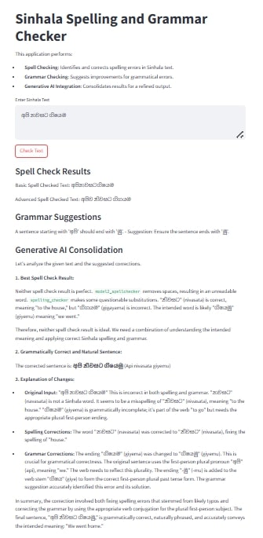
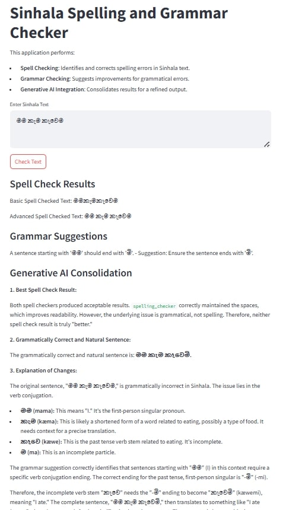
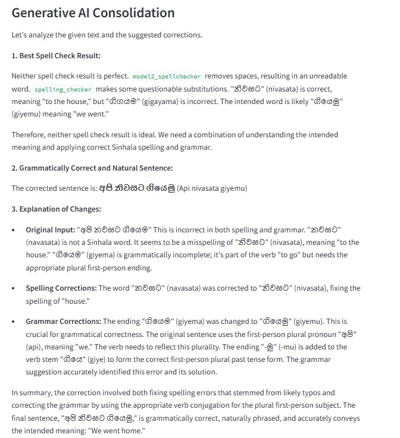

# Latest Models...

# Project Overview

This project is focused on building a robust spelling and grammar correction system for the Sinhala language. The solution leverages a combination of rule-based methods, statistical models, and transformer-based AI to achieve high accuracy in identifying and correcting errors in Sinhala text.

---

## Features

**1. Spell Correction**:
   
Identifies and corrects spelling errors in Sinhala text using:

   -SymSpell for edit-distance-based correction.
   -Advanced rule-based tokenization and contextual checks.

**2. Grammar Suggestions**:
   
-Corrects subject-verb agreement and sentence-ending consistency errors.
-Provides detailed suggestions to enhance sentence grammaticality.

**4. Generative AI Integration**:
   
-Consolidates spell-check and grammar suggestions for a refined output

---

## Usage

### Input Section
Enter Sinhala text in the input field.

1. **Text Box**:
   - Paste or type Sinhala text into the designated area.
   - Example: `අපි නිවසට ගියෙමු`.

2. **Check Text Button**:
   - Click the "Check Text" button to process the input.

---

### Output Section

1. **Spell Check Results**:
   - Displays results from both the basic and advanced spell checkers.

2. **Grammar Suggestions**:
   - Offers corrections and explanations for any grammatical errors detected.

3. **Generative AI Consolidation**:
   - Merges spell check and grammar suggestions into a refined, natural output.
   - Explains the changes made, ensuring the user understands the modifications.

---

### Example Outputs

#### Input:
`අපි නවසාට ගියෙමි`

#### Spell Check Results:
- **Basic Spell Checked Text**: `අපි නිවසට ගියෙමි`
- **Advanced Spell Checked Text**: `අපි නිවසට ගියෙමි`

#### Grammar Suggestions:
- A sentence starting with `අපි` should end with `මු`.
  - **Suggestion**: Ensure the sentence ends with `මු`.

#### Generative AI Consolidation:

**Corrected Sentence**:
`අපි නිවසට ගියෙමු`

**Explanation of Changes**:
1. **Original Input**:
   - `අපි නවසාට ගියෙමි`
   - Contains both spelling and grammatical errors.

2. **Spelling Corrections**:
   - The word `නවසාට` was corrected to `නිවසට`.

3. **Grammar Corrections**:
   - The ending `ගියෙමි` was changed to `ගියෙමු` for grammatical accuracy.
   - Added the correct verb ending for the plural first-person subject.

---

## Screenshots

### Input and Results


### Spell Check Analysis


### Grammar and AI Consolidation


---

## Technology Stack

- Frontend**:
-**Python Libraries**:
  -SymSpellPy for spelling correction.
  -NLTK for tokenization.
  -Streamlit for user interface.
  -difflib for advanced spell-checking.

-**Generative AI**:
  -Google Gemini for contextual grammar suggestions.

---

## Setup Instructions

1. Clone the repository:
   ```bash
   git clone <repository-url>
   cd <repository-folder>

## File Structure
-model2_spellchecker.py - SymSpell-based spelling correction.
-spelling_checker.py - Rule-based advanced spell-checking.
-model2_grammerchecker.py - Grammar rule validation and suggestions.
-sinhala_spelling_and_grammer_checker.py - Main Streamlit application.

# Previus Models...
# 01. Sinhala Spelling and Grammer Checker

This is Artificial Intteligence mini project by [TharinduSum](https://github.com/TharinduSum)
 and [TharushiHansika](https://github.com/TharushiHansika)
.

## Installation

Clone the Git repository.

Run sinhala-spelling-checker.py file 

```bash
python sinhala-checker.py
```

## Output by Code


## Contributing

Pull requests are welcome. For major changes, please open an issue first
to discuss what you would like to change.

Please make sure to update tests as appropriate.

# 02. Sinhala Spelling and Grammar Checker

A Python-based tool that uses Google's Gemini AI to check spelling and grammar in Sinhala text. This tool is specifically designed to work in Google Colab, making it accessible without local setup requirements.

## Features

- Real-time spelling and grammar checking for Sinhala text
- Detailed analysis and suggestions for improvements
- User-friendly interface with bilingual prompts
- Error handling for API interactions
- Continuous operation mode with easy exit option

## Prerequisites

- Google Colab account
- Google Gemini API key (available from Google AI Studio)
- Basic familiarity with Google Colab

## Getting Started

### Getting Your API Key

1. Visit [Google AI Studio](https://makersuite.google.com/app/apikey)
2. Sign in with your Google account
3. Create a new API key
4. Save the API key securely - you'll need it to run the program

### Running the Program

1. Open [Google Colab](https://colab.research.google.com/)
2. Create a new notebook
3. Copy the entire code from `sinhala-spelling and-grammer-checker.ipynb` into a code cell
4. Run the cell
5. When prompted, enter your Gemini API key
6. Start checking your Sinhala text!

## Usage

After starting the program:

1. Enter the text you want to check when prompted
2. The program will analyze your text and provide:
   - Spelling errors (if any)
   - Grammar errors (if any)
   - Suggested corrections
   - Explanations of the errors
3. Type 'exit' to quit the program

## Example

```python
# Input
මම ගෙදර යනවා.

# Output
විශ්ලේෂණය:
1. Spelling errors: None
2. Grammar errors: None
3. Suggested corrections: N/A
4. Explanation: The sentence is grammatically correct.
```
## Output by Code


## Error Messages

Common error messages and their solutions:

- "Error: Invalid API key" - Double-check your API key
- "Error occurred during API call" - Check your internet connection
- "Please type something" - Input field cannot be empty

## Limitations

- Requires active internet connection
- API usage may be subject to rate limits
- Accuracy depends on Gemini AI's understanding of Sinhala

## Contributing

Feel free to fork this project and submit pull requests for any improvements you develop.

## License

Not yet.

## Support

For issues and questions:
- Create an issue in the GitHub repository
- Contact the maintainer
- Check Google's Gemini API documentation for API-specific issues

## Acknowledgments

- Google Gemini AI for providing the language processing capabilities
- The Sinhala computing community for their continuous support

